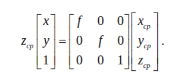
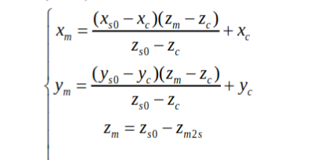

# experiment10 
> ***author:nillin***     
> ***time:2024.10.7***

## part1 相机标定

如图所示，我们假定实际物理坐标系为$oxyz$(即我们假定某点在物理世界中的坐标),相机坐标系为$o_cx_cy_cz_c$（指代中间的汇聚中心    
1.  第一步映射为等效像平面物理坐标到传感器cmos平面的映射
    
其中，$uv1$代表着cmos上的坐标，其中，1意味着坐标平面对于相机坐标系的距离是单位一。这个公式就是很简单的除法，用实际坐标除以pixel得到cmos上的像素坐标。   

2.  第二步映射为相机坐标系下物面到等效像面的映射    
    
其中，$x_{cp}y_{cp}z_{cp}$指pw的坐标，$xy1$指虚拟像面的坐标，$f$是焦距,这是一个简单的相似变换     

3.  第三步是物坐标从物理世界坐标到相机坐标的映射    
    
其中，R,T分别为旋转和平移矩阵，用于调整两个坐标的姿态关系   

于是，我们的到了从物理世界实际物点坐标到相机平面坐标的变换矩阵。        
    
其中$\alpha=f/dx$,$\beta=f/dy$,𝐴𝑚1为内部参数矩阵，由α、β、𝑢0和𝑣0组成，它取决于相机的内部结构；矩阵𝐴𝑚2为外部参数矩阵，由𝑅和𝑇所构成，用来表征相机在界坐坐标系下的姿态关系。在一般情况下，由于相差，会引入一个额外的矩阵来表示，这里用的是小孔成像，理论上不会有相差。

## part2 空间载波相位提取法
**用于求解偏折前坐标**  
由于本次相关的物理量是流体场，所以我们采用投射偏折术测量投射率  
本段的数学公式较多，我省略具体计算过程和数学公式进行叙述大体思路。
1. 通过最下二乘法优化构建相位差因子$\delta(x,y)$的表达形式为
$$\delta_y(x,y)=a\cos(\frac{B_y-\sqrt{B_y^2+4A_y^2}}{4A_y}-0.5)$$

   
后续我们可以使用累积相位增量来表达领域内各点相对该点的相位增量。    
   
后续可以通过3.2.10-3.2.14的方法得到领域点的相位$\psi$值。

## part3 偏折术测量流场密度分布

如图所示，蓝色光线是偏折后的光线，红色光线是原光线。利用简单的两角差公式和反正切公式，我们可以得到x轴和y轴的偏折角，具体如图所示    
    
其中$C(x_c,y_c,z_c)$为相机投影中心在世界坐标下的坐标（实际物理坐标，我的理解是简化计算量，由于cmos的物理尺寸较实际光学系统为小量），这个坐标可以通过下面的公式计算  
    
$M(x_m,y_m,z_m)$是流场的坐标，可以通过简单的平面坐标变换得到，如图所示  
    
其中，$(S_0(x_{s0},y_{s0},z_{s0}))$ 是流场无扰动时光源点的界坐坐标，可以通过空间载
波正交条纹相位提取算法得到。    
这样我们就得到了流场每一点的折射角就确定了，通过Gladston-Dale 关系（𝑛=1+𝐾𝜌）    
    
**conculusion:**
**将偏折角和密度联系起来**

## 实验操作
